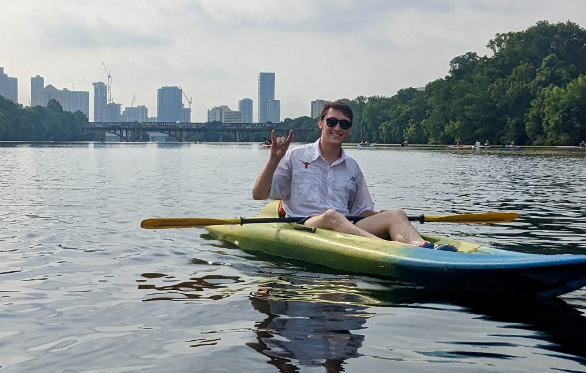

<!-- use just this arrow to get like a line. I think would work well for a picture caption or something along those line > -->

 
    
> Kayaking on Lady Bird Lake in Austin, TX

 <b>Jon Staggs</b>   <em>CSEM PhD Student</em> 

 <a href="https://oden.utexas.edu" target="blank">Oden Institute for Computational Engineering and Sciences</a> 
<a href="https://utexas.edu" target="blank">The University of Texas at Austin</a>

<!-- 
 <a href="">Curriculum vitae </a> 
 -->

 

I am a current PhD student in the [Oden Institute](https://oden.utexas.edu) at the [University of Texas at Austin](http://utexas.edu). My research is broadly in mathematical and theoretical ecology. I obtained my B.S. in Mathematics at UT Austin and my M.S. in Computational and Applied Mathematics at the [University of Washginton](https://amath.washington.edu/).  

I enjoy cooking, lap swimming, alternative keyboard layouts, and Texas football. 

